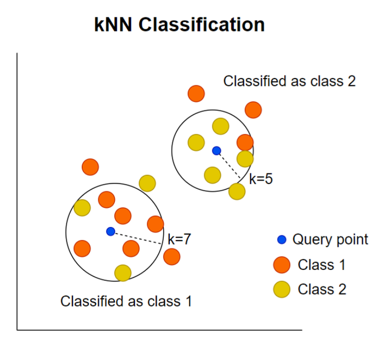

# [K-Nearest Neighbors Classifier]
This directory contains a notebook outlining a description and implementation of the KNN algorithm in Python using numpy and pandas.

__image from https://stataiml.com/posts/knn_in_python__

## [Synopsis] (https://en.wikipedia.org/wiki/K-nearest_neighbors_algorithm)

K-Nearest Neighbors is an algorithm whereby the properties of an unkown vector are predicted using the neighbors around it. The number of neighbors we take into consideration - k - is what gives the algorithm its name.

### Prediction
When classifying a vector into a set of disticnt classes, we simply take the majority class of the neighbors. When performing regression, we take the average value of the outputs.

### Distance Formulas
Different distance formulas an give different neighbors, and thus different predictions. 

Two common distance formulas are:

#### Manhattan Distance
$d_i = \sum{|x^i-y^i|}$

#### Euclidean Distance
$d_i = \sqrt{\sum{(x^i-y^i)^2}}$

A more complete list of distance formulas can be found [here] (https://machinelearningmastery.com/distance-measures-for-machine-learning/)

### Advantages of KNN
- No training period
- Easy to add new data
- Easy to implement

### Disadvantages of KNN
- Predictions are expensive for larger datasets
- Poor performance for high-dimensional data
- Irrelevant features distort predictions
- The whole dataset must be stored for each prediction
- Difficult to find the k that gives optimal predictions
- Unbalanced data gives biased predictions
