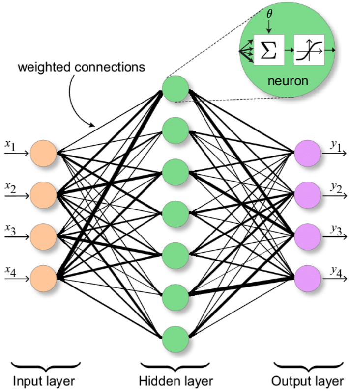

# Multi_Layer_Perrceptrons

Each Multi Layer Perrceptron has three components. The input layer, the hidden layers, and the output layers. 
The input and output layers are only one level deep, while the hidden layer can contain many layers.
The Multi Layer Perrceptron can be used for both regression and classification.

The benefits of a Multi Layer Perrceptrons are that:
1. They can be applied onto non-linear problems
2. They work well with large data
3. They provide quick predictioins once trained

Some issues include:
1. Training can be computationally expensive
2. Performance depends largely on the quality of training
3. Overfitting data is possible - making it difficult to evaluate the performance of a model before its usage
4. Understanding the internal workings of the model is difficult

## Key Components
Just like a single Perceptron, the Multi Layer Perrceptron contains three components.
1. Cost Function
2. Activation FUnction
3. Learning Rate

## Training
To accomplish training, we do the following:
1. ### Forward Pass
  In the forward pass, input data is fed into the neural net, and the output is computed layer by layer, in order. Each Perrceptron computes the weighted sum of its inputs, applies the activation function to the result, and passes the output to the next layer (until we reach the output layer).
  The formula to for a single forward pass for one layer is: 
  
  $z = w_i  *  a_i-1 + bias$
  
  where $z$ is the new activation, and $a_i$- is the activation fo thte previous layer  

2. ### Back propagation
  In this step, we calculate the error contributions from each layer, and work backwards starting at the output node. Backpropagation applies the chain rule at the output of each layer, and performs gradient descent to improve the weights at each node connection.
  One crucial note is that the activation function must be derivable, in order to perform gradient descent.

## Prediction 
The prediction is essentially just getting the last layer's output when performing the forward pass.

