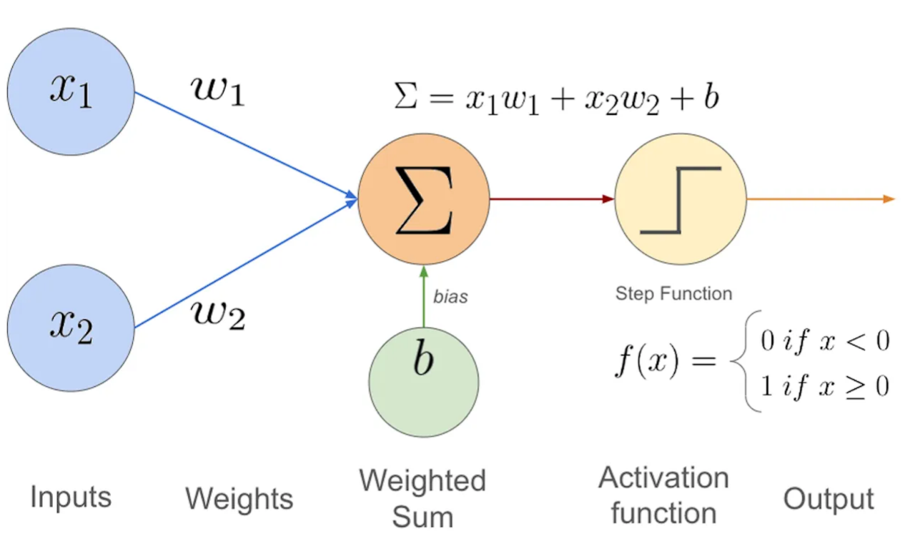
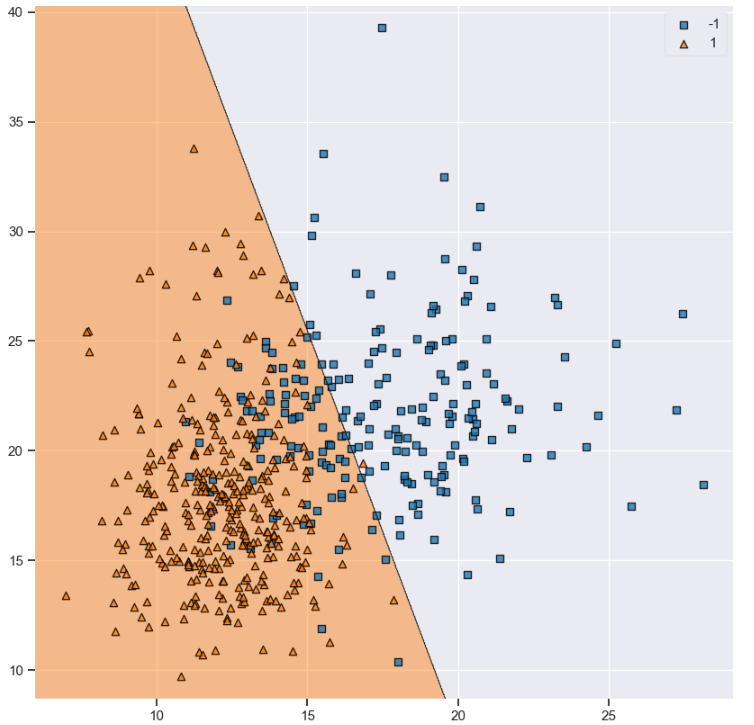

# [Neural Networks](https://en.wikipedia.org/wiki/Neural_network_(machine_learning))

--- 

# [Single Layer Perceptron](https://en.wikipedia.org/wiki/Perceptron)

A perceptron is a type of supervised machine learning model which performs binary classification that map an input feature to an output label.
- Simple to implement
- Limited to linearly separable patterns

## Components of Perceptrons
1. Weights
2. Activation Function
3. Learning Algorithm

## Training the Perceptron
There are three phases in training a Perceptron. 
1. ### *Data Processing*
    Since the perceptron is a binary classifier, the model must split the inputs into two distinct groups. E.g REd/Black, On/Off, Yes/No etc.
    We convert these labels into numrical values such as 0/1 or -1/1 based on the activation function.

2. ### *Predict Results*
    #### Activation Function
    The activation function effects how the inputs will be interpreted. For example, one activation function could be: for any prediction less than 0, output -1 -- for any prediction more than 0, output 1. 
3. ### *Update Weights*
    After calculating the difference between the actual outputs and the predicted outputs, we updatet the weights so that the classification performed maps more accurately onto the actual results. This updating is done via the *Learning Algorithm*.
    #### Learning Algorithm

    The biases and weights are updated using the formula:
    $\newline bias \leftarrow bias * \eta predicted - actual$
    $w_i \leftarrow w_i * \eta (predicted - actual) * x_i \forall i$

This results in the following 

where the data is split into two separate categories.
