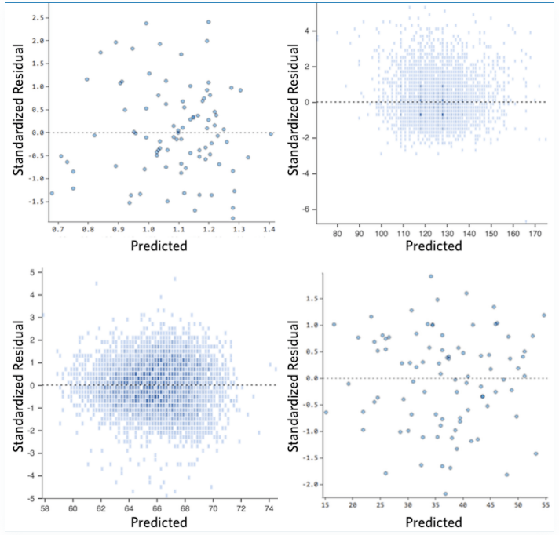
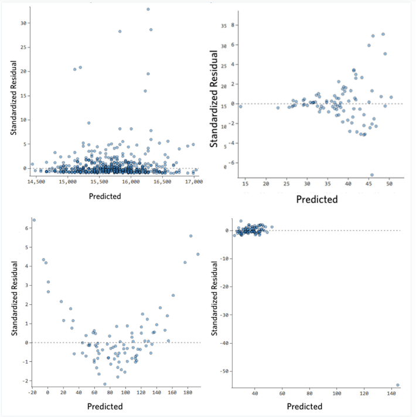

# Decision Tree Regression on Advertising Dataset

This Jupyter Notebook demonstrates how **Decision Trees** can be used for regression on an Advertising dataset, predicting sales based on spending on **TV**, **radio**, and **newspaper** advertising.

## Table of contents:
- [Workflow](#workflow)
- [Data Preprocessing](#data-preprocessing)
- [Model Initialization and Training](#model-initialization-and-training)
- [Model Evaluation](#model-evaluation)
  - [Error Metrics](#error-metrics)
  - [Error vs Max Depth Analysis](#error-vs-max-depth-analysis)
  - [Residual Analysis](#residual-analysis)
- [Visualization](#visualization)
- [Conclusion](#conclusion)
---

## Workflow

The notebook follows three phases:
1. **Data Preprocessing**
2. **Model Initialization and Training**
3. **Model Evaluation**

---

## Data Preprocessing

This phase prepares the dataset by:
- Importing essential libraries (`scikit-learn`, `pandas`, `numpy`, `matplotlib`).
- Reading `Advertising.csv`.
- Dropping unnecessary columns (e.g., `Index`).
- Scaling numeric features (`TV`, `radio`, `newspaper`) with `StandardScaler`.
- Splitting data into training and test sets using `train_test_split`.

### **Why scale?**  
Scaling ensures features are on the same scale, allowing the model to interpret their relative importance correctly.

---

## Model Initialization and Training

- Initialize a **DecisionTreeRegressor** with `max_depth=3`.
- Train on the preprocessed training set.
- Visualize the trained tree using `plot_tree()`.

### **Squared Error in Nodes**  
Squared error indicates target variance within each node; smaller values mean purer, more homogenous nodes.

---

## Model Evaluation

### Error Metrics

Evaluate model performance with standard regression metrics:

- **Mean Squared Error (MSE)**  
  $MSE = \frac{1}{n} \sum_{i=1}^{n} (y_i - \hat{y}_i)^2$

- **Root Mean Squared Error (RMSE)**  
  $RMSE = \sqrt{MSE}$

- **Mean Absolute Error (MAE)**  
  $MAE = \frac{1}{n} \sum_{i=1}^{n} |y_i - \hat{y}_i|$

- **R-squared (R²)**  
  $R^2 = 1 - \frac{SS_{res}}{SS_{tot}}$

---

### Error vs Max Depth Analysis

- Train models with varying `max_depth`.
- Plot **actual vs predicted sales** at each depth.
- **Observations:**
  - Deeper trees can model data with finer granularity.
  - Increasing depth reduces error but risks overfitting if depth is too large.

---

### Residual Analysis
While the error metrics used above may tell us how large our errors are on average, they don't display how the errors are distributed. Residual plots display this, and help us figure out whether errors are randomly scattered around zero, or if they show systemic patterns.
Residuals are calculated as:
$Residual = y_{test} - y_{pred}$

**Interpretation:**
- Positive residual → prediction too low.
- Negative residual → prediction too high.
- Near-zero residual → accurate prediction.

An ideal residual plot:
- Residuals scatter symmetrically around zero.
- No clear patterns.
- Residuals remain close to 0.

If residuals _do_ show patterns, they may display information we can use to correct our model. Some examples certain residual plots and some corrections we might apply to them are:
- A curve or trend $\rightarrow$ model misses nonlinearity in data
- Points mostly positive or negative in some ranges $\rightarrow$ model systemically over- or under-predicts
- Large magnitude in a few points $\rightarrow$ outliers in data
- Funnel shape $\rightarrow$ may indicate missing variable

---

## Visualization

- **Decision Tree Plot:** shows feature splits at each node.
- **Actual vs Predicted Scatter Plots:** for various depths.
- **Residuals Plot:** shows model errors as a function of predicted values.

--- 

## Conclusion
The notebook shows:
- How Decision Trees partition feature space for regression.
- The trade-off between model complexity (max depth) and overfitting.
- That a shallow tree (e.g., depth 3) can give a good balance of accuracy and interpretability for this dataset.
---
